# 介绍
模仿termius的服务器运维工具，实现了termius的80%的重要功能，后续会加入对服务器监控，服务监控等，故称为plus

# 目前实现功能
## 服务器组列表
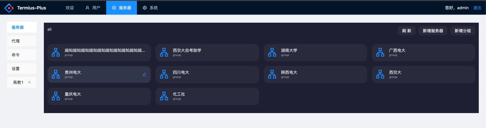
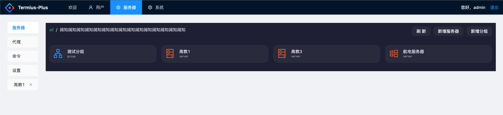
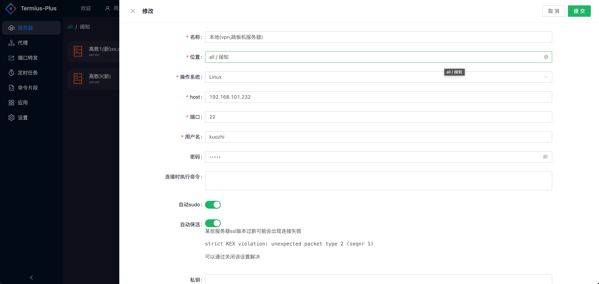

## 连接服务器
### 终端
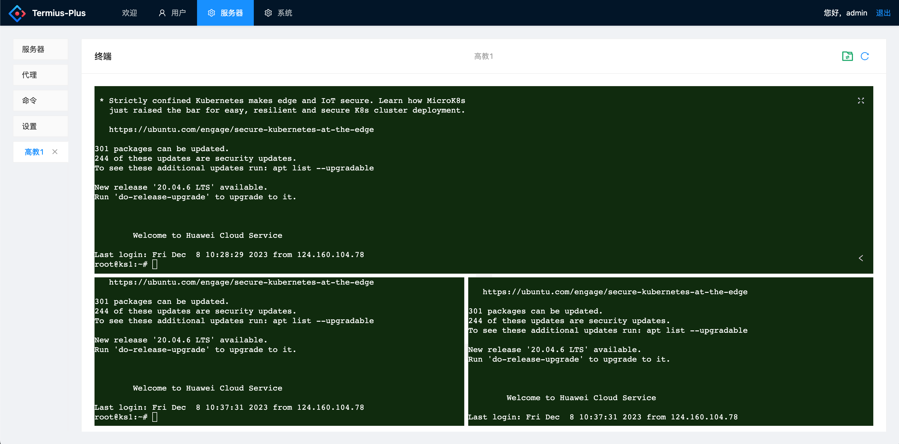
### 支持为每个服务器单独记录文档
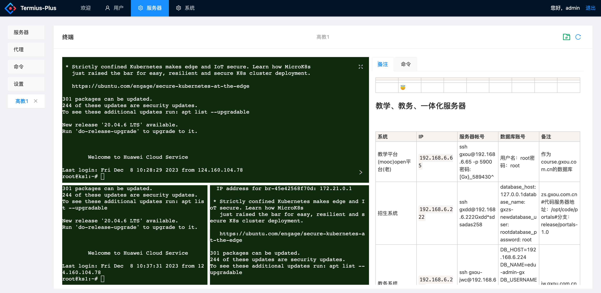
### 执行自定义命令
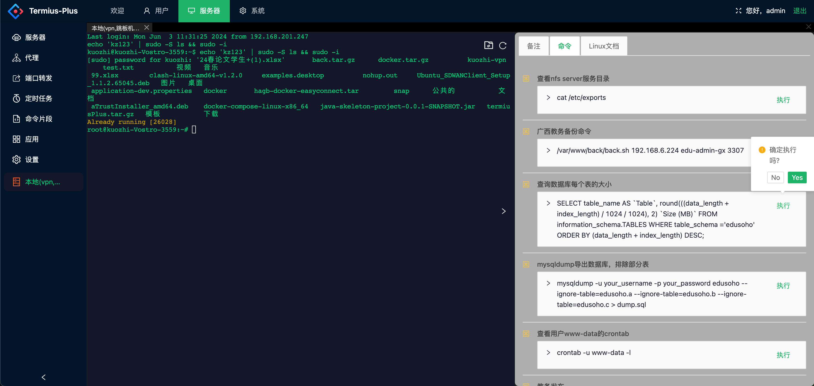
### sftp
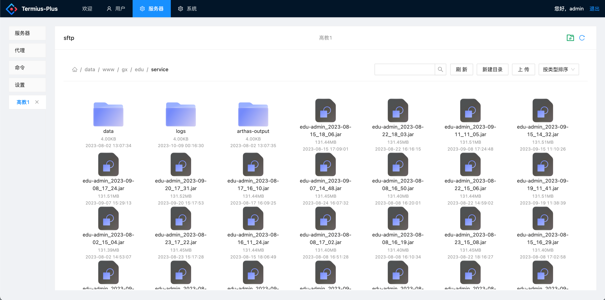 
#### 基本文件操作
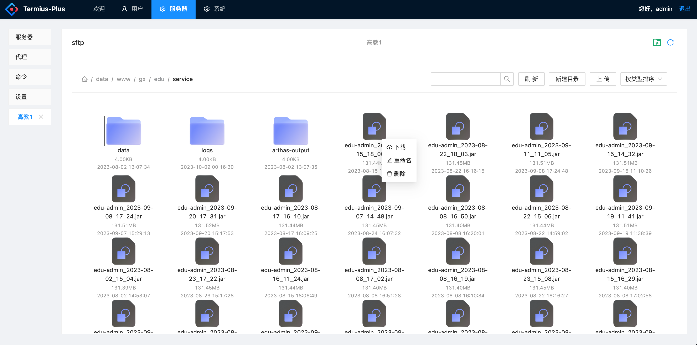
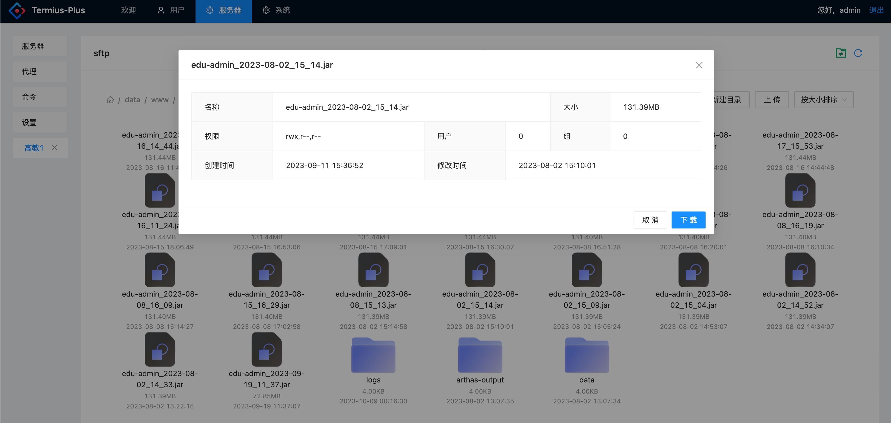
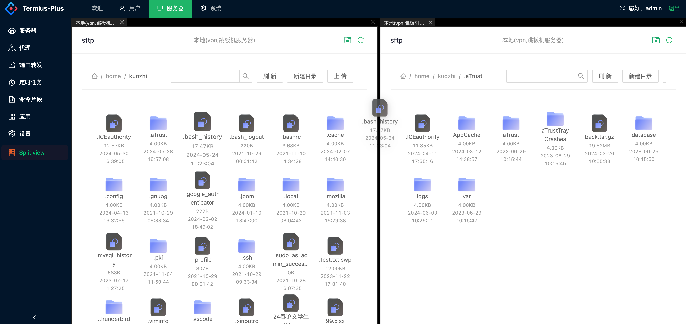


## 主题色
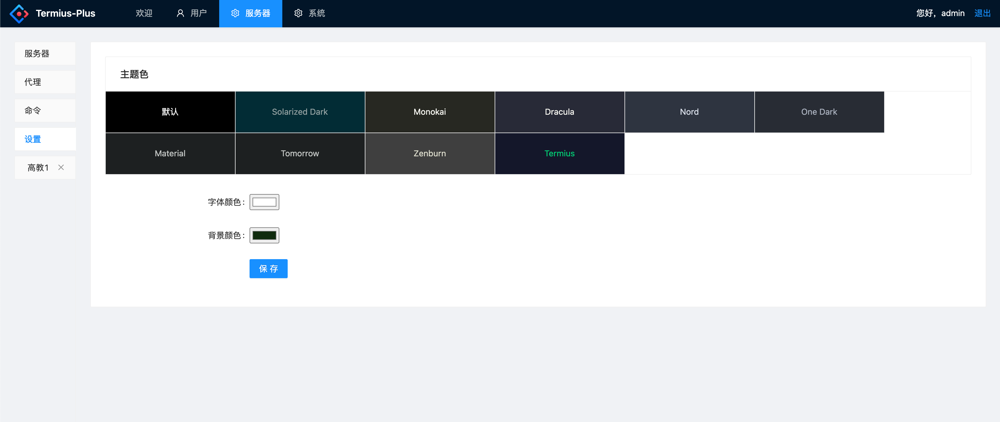

## 自定义命令片段
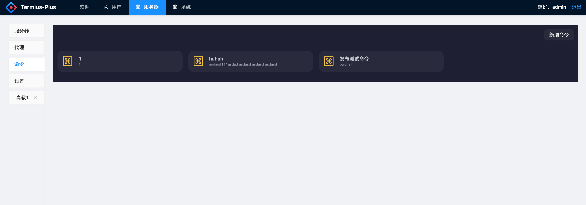
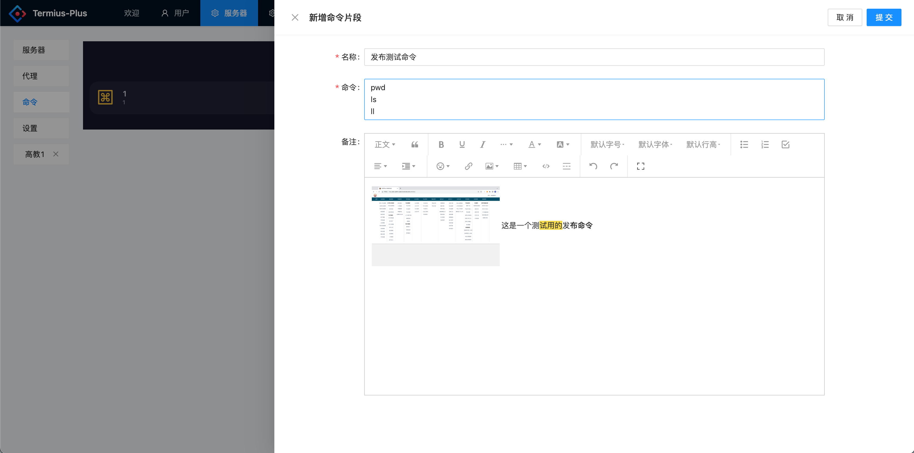


## 自定义代理
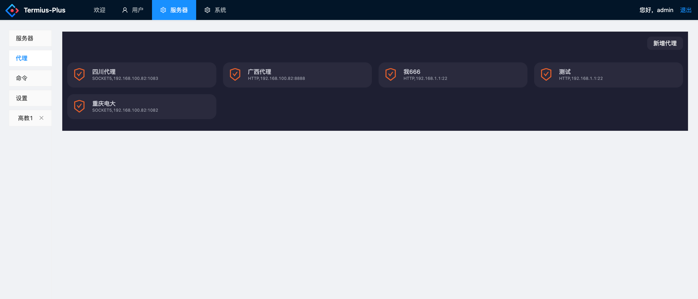
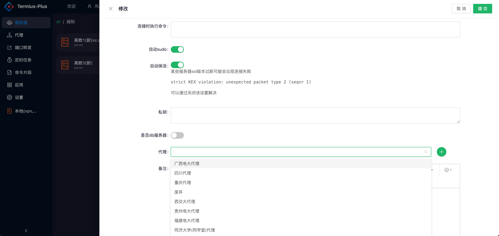

# 部署安装
## docker

```shell
git clone https://gitee.com/zimehjl/termius-plus.git
cd termius-plus/scripts/docker
#修改server.env文件中的配置
docker-compose up -d
#根据docker-compose.yml中的front配置，访问http://ip:9999
```

# 开发
## 普通 Spring Boot + Vue + Mysql + Redis 的结构

### 前端
ui框架 ant-design-vue

终端部分采用 xterm.js

代码编辑器 codemirror

``` shell
# 进入前端目录
cd web/admin 
# 安装依赖
yarn install
# 启动
yarn serve
```

### 后端
持久层框架 spring data jpa，querydsl

工具类 hutool

ssh连接，sftp，端口转发等功能使用 sshj

数据库版本管理 flyway

钉钉机器人通知 dinger

#### 运行
建立数据库，要求 mysql8.0+

复制 application-dev.properties.dist 为 application-dev.properties
, 修改其中的数据库配置，启动！

