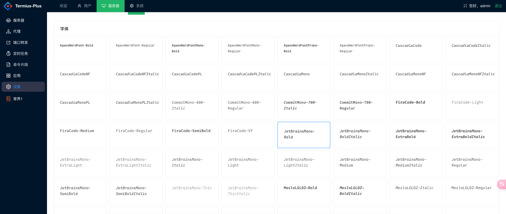

# 介绍
高效美观易用的服务器运维工具。

# 功能列表
## 服务器组列表


## 连接服务器
### 终端

### 支持为每个服务器单独记录文档

### 执行自定义命令

### 内置linux命令文档，可以快速查看命令用法

### sftp
 
### 编辑器功能


#### 编辑器
编辑器采用VSCode的上流库monaco-editor，支持多种语言高亮，语法提示，代码自动补全，代码格式化等功能。并接入了ai补全，可以自动完成一些常用代码。

#### 基本文件操作


##### 分屏拖拽可直接服务器对服务器传递文件
ps:多浏览器标签页也可以


## 权限管理
##### 基于角色赋予服务器权限，支持多角色，多用户管理


## 主题色

### 字体
默认采用JetBrainsMono-Bold字体


## 自定义命令片段


## 自定义代理


### 支持组上设置代理,服务器连接时会就近使用


## 应用
目前主要是网站，后续支持更多类型应用

### 信息
#### 记录应用各种信息，其中的负责人手机号用于后续监控告警

### 身份
#### 记录应用的账号/密码等身份信息，用于后续登录等维护

### 监控
#### 可以对应用的一个端点进行监控，并使用正则判断是否有异常，并发送钉钉通知

##### 监控效果，如果异常会显示异常时间，并发送钉钉通知

### 服务器
#### 记录应用所用服务器，用于后续服务器运维。也可以实现应用架构图

##### 架构图


## 端口转发
### 支持动态端口转发，方便直接访问服务,如内部的mysql，redis等。或不公开的站点


## 定时任务
#### 使用类java语言的mvel表达式脚本，支持cron表达式的定时任务
##### 提供全局变量session，可以直接访问服务器执行命令。
##### DingerRequest对象，可以发送钉钉通知


## 日志
#### 记录每次操作的日志，方便后续问题排查
##### 日志采用缓存区+文件的方式，避免频繁写入磁盘，提高性能


# 部署安装
## docker

```shell
git clone https://gitee.com/zimehjl/termius-plus.git
cd termius-plus/scripts/docker
#修改server.env文件中的配置
#修改.env中的版本号当前最新为v1.6.4。查看server/pom.xml中的version可得知最新版本
docker-compose up -d
#根据docker-compose.yml中的front配置，访问http://ip:9999
```

# 开发
## 普通 Spring Boot + Vue + Mysql + Redis 的结构

### 前端
ui框架 ant-design-vue

终端部分采用 xterm.js

代码编辑器 codemirror,monaco-editor

``` shell
# 进入前端目录
cd web/admin 
# 安装依赖
yarn install
# 启动
yarn serve
```

### 后端
持久层框架 spring data jpa，querydsl

工具类 hutool

ssh连接，sftp，端口转发等功能使用 sshj

数据库版本管理 flyway

钉钉机器人通知 dinger

rdp转websocket apache guacamole

#### 后端启动前运行
```shell
mvn compile
```
生成querydsl查询代码


#### 运行
建立数据库，要求 mysql8.0+

复制 .env.dist 为 .env, 修改其中的数据库配置，启动！

